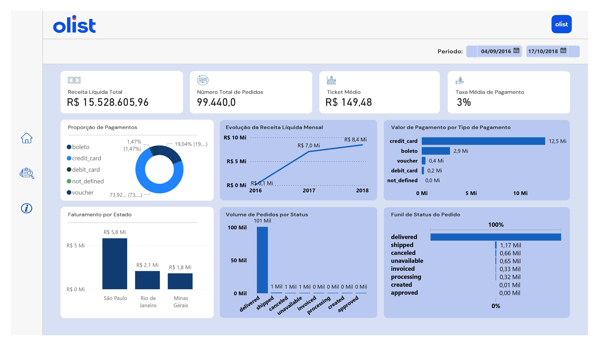
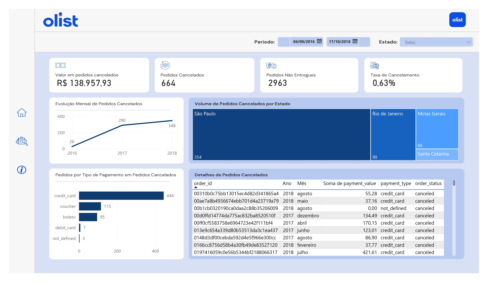
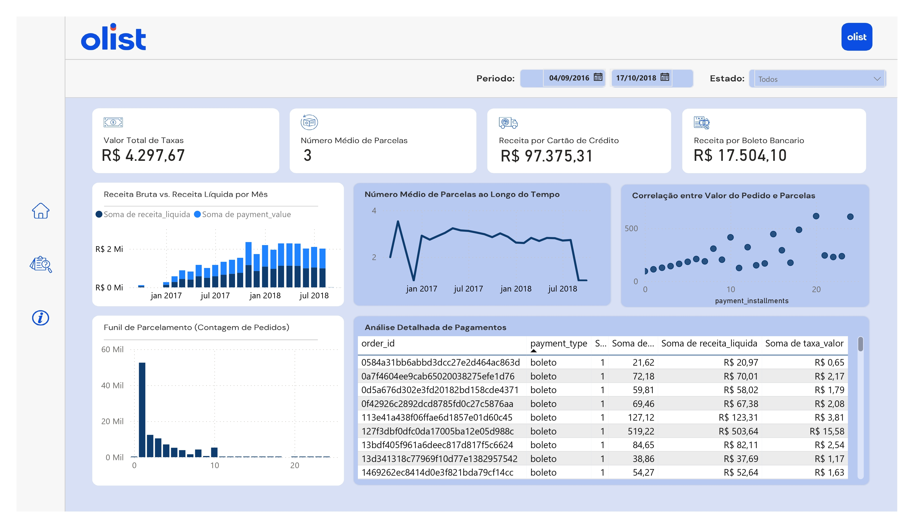

# Análise de Vendas e Conciliação Financeira - E-commerce Olist

Este projeto apresenta uma análise de dados de ponta a ponta, desde a limpeza e o tratamento de dados brutos até a criação de um dashboard interativo no Power BI para a tomada de decisão estratégica. A análise simula um desafio comum em empresas de varejo online: a conciliação de vendas e o monitoramento de KPIs financeiros.

## 🎯 Objetivo do Projeto

O principal objetivo deste projeto foi desenvolver uma solução de análise para:
-   **Extrair e tratar** dados de vendas e pagamentos de um e-commerce.
-   **Conciliar** transações de vendas com os pagamentos recebidos, identificando discrepâncias e riscos.
-   **Desenvolver KPIs** e dashboards para monitorar a saúde financeira do negócio.
-   **Realizar análises investigativas** para identificar oportunidades e pontos de melhoria.

## ⚙️ Ferramentas e Tecnologias

* **Python**: Linguagem de programação utilizada para a etapa de tratamento e análise inicial dos dados.
* **Pandas**: Biblioteca fundamental para a manipulação, limpeza e transformação dos dados.
* **Power BI**: Ferramenta de Business Intelligence utilizada para a criação do dashboard, visualização e modelagem de dados.
* **DAX (Data Analysis Expressions)**: Linguagem de fórmula utilizada no Power BI para a criação de medidas e indicadores.
* **Microsoft Excel**: Utilizado na fase inicial para inspeção dos datasets.

## 📊 Análise e Estrutura do Dashboard

O dashboard foi estruturado em três páginas principais, cada uma com um foco específico, para fornecer uma visão completa do negócio:

### **1. Visão Geral Financeira**
A primeira página apresenta uma visão de alto nível da performance do negócio, com os principais indicadores de receita, volume de vendas e comportamento do cliente.
-   **KPIs:** Receita Líquida Total, Número Total de Pedidos, Ticket Médio, Taxa Média de Pagamento.
-   **Gráficos:** Evolução da Receita Líquida Mensal, Volume de Pedidos por Status, entre outros.

### **2. Conciliação e Discrepâncias**
Esta página é dedicada à análise investigativa e à identificação de riscos. Ela monitora a taxa de cancelamentos e outras discrepâncias que podem impactar a saúde financeira da empresa.
-   **KPIs:** Pedidos Cancelados, Pedidos Não Entregues, Taxa de Cancelamento.
-   **Análise:** Gráfico de volume de cancelamentos por tipo de pagamento e por estado, detalhando os pedidos problemáticos em uma tabela para investigação.

### **3. Análise de Pagamentos**
A última página aprofunda a análise no universo dos pagamentos, explorando o impacto das taxas e o comportamento de parcelamento dos clientes.
-   **Gráficos:** Comparação entre Receita Bruta e Líquida, Média do Valor do Pedido por Número de Parcelas.
-   **Tabela:** Detalhamento granular de cada transação, com valores de receita e taxas.

## 🖼️ Visualização do Projeto

## 🧑‍💻 Como Executar o Projeto

1.  **Clone o repositório:** `git clone [link_do_seu_repositorio]`
2.  **Abra o arquivo `.pbix`**: O projeto pode ser visualizado no Power BI Desktop.
3.  **Explore as Análises**: Navegue pelas páginas para interagir com os filtros e dashboards.
